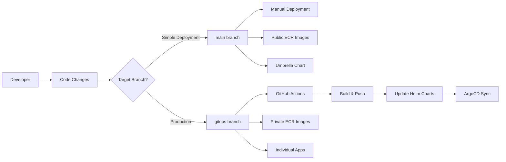

# Branching Strategy & GitOps Workflow

## 🏗️ Branch Architecture

This repository implements a **dual-branch GitOps strategy** designed for different deployment scenarios with clear separation between simple public deployments and production-ready automated workflows.



## 🌐 Public Application (Main Branch)

### **Purpose**
Simple deployment with public container images for demos, learning, and quick testing.

### **Characteristics**
```yaml
✅ Branch: main
✅ Images: Public ECR (stable versions)
✅ Deployment: Manual Helm chart management
✅ ArgoCD: Umbrella chart (retail-store-app)
✅ Workflows: None (no .github/workflows/)
✅ Updates: Manual only
✅ Target: Demos, learning, simple deployments
```
### **Image Configuration**
```yaml
# All services use public ECR images
ui: public.ecr.aws/aws-containers/retail-store-sample-ui:1.2.2
catalog: public.ecr.aws/aws-containers/retail-store-sample-catalog:1.2.2
cart: public.ecr.aws/aws-containers/retail-store-sample-cart:1.2.2
checkout: public.ecr.aws/aws-containers/retail-store-sample-checkout:1.2.2
orders: public.ecr.aws/aws-containers/retail-store-sample-orders:1.2.2

# Infrastructure components
mysql: public.ecr.aws/docker/library/mysql:8.0
redis: public.ecr.aws/docker/library/redis:6.0-alpine
postgresql: public.ecr.aws/docker/library/postgres:13
rabbitmq: public.ecr.aws/docker/library/rabbitmq:3.8-management
dynamodb-local: public.ecr.aws/aws-dynamodb-local/aws-dynamodb-local:1.25.1
```

### **ArgoCD Configuration**
```yaml
# Uses umbrella chart for simplified management
apiVersion: argoproj.io/v1alpha1
kind: Application
metadata:
  name: retail-store-app
spec:
  source:
    targetRevision: main
    path: src/app/chart
```

## 🏭 Production (GitOps Branch)

### **Purpose**
Full production workflow with automated CI/CD pipeline and private container registry integration.

### **Characteristics**
```yaml
✅ Branch: gitops
✅ Images: Private ECR (auto-updated)
✅ Deployment: Automated via GitHub Actions
✅ ArgoCD: Individual service applications
✅ Workflows: Full CI/CD pipeline (.github/workflows/)
✅ Updates: Automatic on code changes
✅ Target: Production environments, enterprise deployments
```

### **Image Configuration**
```yaml
# Services use private ECR (updated by workflow)
ui: {AWS_ACCOUNT_ID}.dkr.ecr.{REGION}.amazonaws.com/retail-store-ui:{COMMIT_HASH}
catalog: {AWS_ACCOUNT_ID}.dkr.ecr.{REGION}.amazonaws.com/retail-store-catalog:{COMMIT_HASH}
cart: {AWS_ACCOUNT_ID}.dkr.ecr.{REGION}.amazonaws.com/retail-store-cart:{COMMIT_HASH}
checkout: {AWS_ACCOUNT_ID}.dkr.ecr.{REGION}.amazonaws.com/retail-store-checkout:{COMMIT_HASH}
orders: {AWS_ACCOUNT_ID}.dkr.ecr.{REGION}.amazonaws.com/retail-store-orders:{COMMIT_HASH}

# Infrastructure components (same as main - preserved by workflow)
mysql: public.ecr.aws/docker/library/mysql:8.0
redis: public.ecr.aws/docker/library/redis:6.0-alpine
postgresql: public.ecr.aws/docker/library/postgres:13
rabbitmq: public.ecr.aws/docker/library/rabbitmq:3.8-management
dynamodb-local: public.ecr.aws/aws-dynamodb-local/aws-dynamodb-local:1.25.1
```
### **ArgoCD Configuration**
```yaml
# Uses individual applications for granular control
- retail-store-ui
- retail-store-catalog  
- retail-store-cart
- retail-store-checkout
- retail-store-orders

# Each points to gitops branch
spec:
  source:
    targetRevision: gitops
```

## 🔧 GitHub Actions Setup

### **Required Secrets**
Configure these secrets in your GitHub repository settings:

| Secret Name | Description | Example |
|-------------|-------------|---------|
| `AWS_ACCESS_KEY_ID` | AWS Access Key for ECR/EKS access | `AKIA...` |
| `AWS_SECRET_ACCESS_KEY` | AWS Secret Key | `wJalrXUt...` |
| `AWS_REGION` | AWS Region for resources | `us-west-2` |
| `AWS_ACCOUNT_ID` | AWS Account ID for ECR URLs | `123456789012` |

### **IAM Permissions Required**
```json
{
  "Version": "2012-10-17",
  "Statement": [
    {
      "Effect": "Allow",
      "Action": [
        "ecr:GetAuthorizationToken",
        "ecr:BatchCheckLayerAvailability",
        "ecr:GetDownloadUrlForLayer",
        "ecr:BatchGetImage",
        "ecr:InitiateLayerUpload",
        "ecr:UploadLayerPart",
        "ecr:CompleteLayerUpload",
        "ecr:PutImage",
        "ecr:CreateRepository",
        "ecr:DescribeRepositories"
      ],
      "Resource": "*"
    }
  ]
}
```
## 🔄 Deployment Workflows

### **Public Application Workflow**
```bash
1. Developer commits to main branch
2. Manual deployment required
3. Uses stable public images
4. ArgoCD syncs umbrella chart
5. All services deployed together
```

### **Production Workflow**
```bash
1. Developer commits to gitops branch (src/ directory)
2. GitHub Actions detects changes
3. Builds only changed services
4. Pushes images to private ECR
5. Updates Helm chart values with new image tags
6. Commits changes back to gitops branch
7. ArgoCD syncs individual applications
8. Only changed services are redeployed
```

### **Change Detection Logic**
```yaml
# Only builds services with actual code changes
Changed files in src/ui/ → Build ui service
Changed files in src/catalog/ → Build catalog service
Changed files in src/cart/ → Build cart service
Changed files in src/checkout/ → Build checkout service
Changed files in src/orders/ → Build orders service

# Manual trigger builds all services
workflow_dispatch → Build all services
```
## 🏗️ Infrastructure Components

### **Service Images vs Infrastructure Images**

#### **Service Images (Updated by Workflow)**
- **ui, catalog, cart, checkout, orders** - Application services
- **Source**: Private ECR repositories
- **Updates**: Automated via GitHub Actions
- **Versioning**: Git commit hash (7 characters)

#### **Infrastructure Images (Preserved by Workflow)**
- **mysql, redis, postgresql, rabbitmq, dynamodb-local** - Database/messaging
- **Source**: Public ECR/Docker Hub
- **Updates**: Manual only (stable versions)
- **Versioning**: Semantic versioning

### **Workflow Protection Logic**
```bash
# AWK script ensures only main service image is updated
/^image:/ { in_main_image = 1 }  # Target first image: section only
in_main_image && /repository:/ && !updated_repo { 
  # Update only if we haven't updated repository yet
}
/^[a-zA-Z]/ && !/^image:/ { in_main_image = 0 }  # Exit image section
```
