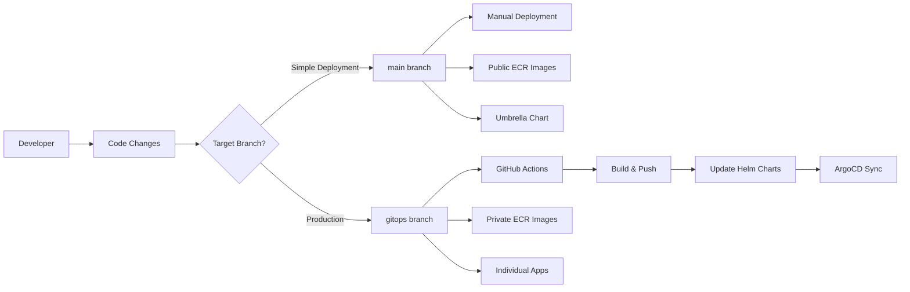

# Branching Strategy & GitOps Workflow

## 🏗️ Branch Architecture

This repository implements a **dual-branch GitOps strategy** designed for different deployment scenarios with clear separation between simple public deployments and production-ready automated workflows.



## 🌐 Public Application (Main Branch)

### **Purpose**
Simple deployment with public container images for demos, learning, and quick testing.

### **Characteristics**
```yaml
✅ Branch: main
✅ Images: Public ECR (stable versions)
✅ Deployment: Manual Helm chart management
✅ ArgoCD: Umbrella chart (retail-store-app)
✅ Workflows: None (no .github/workflows/)
✅ Updates: Manual only
✅ Target: Demos, learning, simple deployments
```