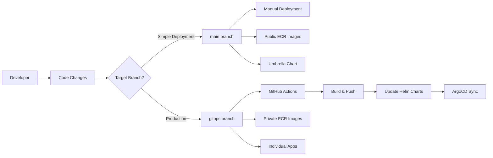

# Branching Strategy & GitOps Workflow

## 🏗️ Branch Architecture

This repository implements a **dual-branch GitOps strategy** designed for different deployment scenarios with clear separation between simple public deployments and production-ready automated workflows.



## 🌐 Public Application (Main Branch)

### **Purpose**
Simple deployment with public container images for demos, learning, and quick testing.

### **Characteristics**
```yaml
✅ Branch: main
✅ Images: Public ECR (stable versions)
✅ Deployment: Manual Helm chart management
✅ ArgoCD: Umbrella chart (retail-store-app)
✅ Workflows: None (no .github/workflows/)
✅ Updates: Manual only
✅ Target: Demos, learning, simple deployments
```
### **Image Configuration**
```yaml
# All services use public ECR images
ui: public.ecr.aws/aws-containers/retail-store-sample-ui:1.2.2
catalog: public.ecr.aws/aws-containers/retail-store-sample-catalog:1.2.2
cart: public.ecr.aws/aws-containers/retail-store-sample-cart:1.2.2
checkout: public.ecr.aws/aws-containers/retail-store-sample-checkout:1.2.2
orders: public.ecr.aws/aws-containers/retail-store-sample-orders:1.2.2

# Infrastructure components
mysql: public.ecr.aws/docker/library/mysql:8.0
redis: public.ecr.aws/docker/library/redis:6.0-alpine
postgresql: public.ecr.aws/docker/library/postgres:13
rabbitmq: public.ecr.aws/docker/library/rabbitmq:3.8-management
dynamodb-local: public.ecr.aws/aws-dynamodb-local/aws-dynamodb-local:1.25.1
```

### **ArgoCD Configuration**
```yaml
# Uses umbrella chart for simplified management
apiVersion: argoproj.io/v1alpha1
kind: Application
metadata:
  name: retail-store-app
spec:
  source:
    targetRevision: main
    path: src/app/chart
```

## 🏭 Production (GitOps Branch)

### **Purpose**
Full production workflow with automated CI/CD pipeline and private container registry integration.

### **Characteristics**
```yaml
✅ Branch: gitops
✅ Images: Private ECR (auto-updated)
✅ Deployment: Automated via GitHub Actions
✅ ArgoCD: Individual service applications
✅ Workflows: Full CI/CD pipeline (.github/workflows/)
✅ Updates: Automatic on code changes
✅ Target: Production environments, enterprise deployments
```

### **Image Configuration**
```yaml
# Services use private ECR (updated by workflow)
ui: {AWS_ACCOUNT_ID}.dkr.ecr.{REGION}.amazonaws.com/retail-store-ui:{COMMIT_HASH}
catalog: {AWS_ACCOUNT_ID}.dkr.ecr.{REGION}.amazonaws.com/retail-store-catalog:{COMMIT_HASH}
cart: {AWS_ACCOUNT_ID}.dkr.ecr.{REGION}.amazonaws.com/retail-store-cart:{COMMIT_HASH}
checkout: {AWS_ACCOUNT_ID}.dkr.ecr.{REGION}.amazonaws.com/retail-store-checkout:{COMMIT_HASH}
orders: {AWS_ACCOUNT_ID}.dkr.ecr.{REGION}.amazonaws.com/retail-store-orders:{COMMIT_HASH}

# Infrastructure components (same as main - preserved by workflow)
mysql: public.ecr.aws/docker/library/mysql:8.0
redis: public.ecr.aws/docker/library/redis:6.0-alpine
postgresql: public.ecr.aws/docker/library/postgres:13
rabbitmq: public.ecr.aws/docker/library/rabbitmq:3.8-management
dynamodb-local: public.ecr.aws/aws-dynamodb-local/aws-dynamodb-local:1.25.1
```

